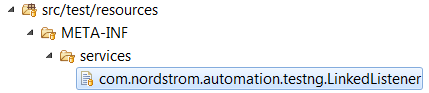

[](https://maven-badges.herokuapp.com/maven-central/com.nordstrom.tools/testng-foundation)

# INTRODUCTION

**TestNG Foundation** is a lightweight collection of TestNG listeners, interfaces, and static utility classes that supplement and augment the functionality provided by the TestNG API. The facilities provided by **TestNG Foundation** include two types of runtime listener hooks, test artifact capture, and automatic test context attribute propagation.

Future releases of **TestNG Foundation** will add automatic retry of failed tests, test execution timeout management, and target platform support. See [ExecutionFlowController](https://github.com/Nordstrom/TestNG-Foundation/blob/master/src/main/java/com/nordstrom/automation/testng/ExecutionFlowController.java) for more information.

## TestNG Listeners

* [ExecutionFlowController](https://github.com/Nordstrom/TestNG-Foundation/blob/master/src/main/java/com/nordstrom/automation/testng/ExecutionFlowController.java):  
**ExecutionFlowController** is a TestNG listener that performs several basic functions related to test method execution: 
  * **ExecutionFlowController** propagates test context attributes: [_before_ method] → [test method] → [_after_ method]  
This feature enables tests to attach context-specific values that are accessible throughout the entire lifecycle of the test.  
  * For test classes that implement the **IInvokedMethodListenerEx** interface, **ExecutionFlowController** forwards calls from its own invoked method listener implementation to the corresponding methods in the test class. In-bound attribute propagation is performed before forwarding the `beforeInvocation(IInvokedMethod, ITestResult)` call, and out-bound attribute propagation is performed after forwarding the `afterInvocation(IInvokedMethod, ITestResult)` call.
  * For methods that don't specify a timeout interval, **ExecutionFlowController** sets the configured (or default) standard interval.
  *  If automatic retry of failed tests is enabled, **ExecutionFlowController** attaches the specified (or default) retry analyzer to each test method with no prior declaration.  
  **NOTE**: TestNG sets the status of retried tests to `SKIP`. The 'throwable' of these retried tests distinguishes them from actual skipped tests, for which the 'throwable' is **`org.testng.SkipException`**.
* [ListenerChain](https://github.com/Nordstrom/TestNG-Foundation/blob/master/src/main/java/com/nordstrom/automation/testng/ListenerChain.java):  
**ListenerChain** is a TestNG listener that enables you to add other listeners at runtime and guarantees the order in which they're invoked. This is similar in behavior to a JUnit rule chain. **ListenerChain** also provides static methods that enable you to acquire references to listeners that are linked into the chain.
* [ArtifactCollector](https://github.com/Nordstrom/TestNG-Foundation/blob/master/src/main/java/com/nordstrom/automation/testng/ArtifactCollector.java):  
**ArtifactCollector** is a TestNG [test listener](http://javadox.com/org.testng/testng/6.8/org/testng/ITestListener.html) that serves as the foundation for artifact-capturing test listeners. This is a generic class, with the artifact-specific implementation provided by instances of the **ArtifactType** interface. See the **Interfaces** section below for more details.

## Interfaces

* [LinkedListener](https://github.com/Nordstrom/TestNG-Foundation/blob/master/src/main/java/com/nordstrom/automation/testng/LinkedListener.java):  
This is a marker interface for listeners that can be linked to the **ListenerChain** via its service loader.
* [IInvokedMethodListenerEx](https://github.com/Nordstrom/TestNG-Foundation/blob/master/src/main/java/com/nordstrom/automation/testng/IInvokedMethodListenerEx.java):  
Test classes that implement the **IInvokedMethodListenerEx** interface are hooked in by the invoked method listener implementation of **ExecutionFlowController**. See the **TestNG Listeners** section above for more details.
* [ArtifactType](https://github.com/Nordstrom/TestNG-Foundation/blob/master/src/main/java/com/nordstrom/automation/testng/ArtifactType.java):  
Classes that implement the **ArtifactType** interface provide the artifact-specific methods used by the **ArtifactCollector** listener to capture and store test-related artifacts. The unit tests for this project include a reference implementation (**UnitTestArtifact**) provides a basic outline for a scenario-specific artifact provider. This artifact provider is specified as the superclass type parameter in the **UnitTestCapture** listener, which is a lightweight extension of **ArtifactCollector**. The most basic example is shown below:

###### Implementing ArtifactType
```java
package com.example;

import java.nio.file.Path;

import org.slf4j.Logger;
import org.slf4j.LoggerFactory;
import org.testng.ITestResult;

import com.nordstrom.automation.testng.ArtifactType;

public class MyArtifactType implements ArtifactType {
    
    private static final String ARTIFACT_PATH = "artifacts";
    private static final String EXTENSION = "txt";
    private static final String ARTIFACT = "This text artifact was captured for '%s'";
    private static final Logger LOGGER = LoggerFactory.getLogger(MyArtifactType.class);

    @Override
    public boolean canGetArtifact(ITestResult result) {
        return true;
    }

    @Override
    public byte[] getArtifact(ITestResult result) {
        return String.format(ARTIFACT, result.getName()).getBytes().clone();
    }

    @Override
    public Path getArtifactPath(ITestResult result) {
        return ArtifactType.super.getArtifactPath(result).resolve(ARTIFACT_PATH);
    }
    
    @Override
    public String getArtifactExtension() {
        return EXTENSION;
    }

    @Override
    public Logger getLogger() {
        return LOGGER;
    }
}
```

###### Creating a type-specific artifact collector
```java
package com.example;

import com.nordstrom.automation.testng.ArtifactCollector;

public class MyArtifactCapture extends ArtifactCollector<MyArtifactType> {
    
    public MyArtifactCapture() {
        super(new MyArtifactType());
    }
    
}
```

The preceding code is an example of how the artifact type definition is assigned as the type parameter in a subclass of **ArtifactCollector**. Because TestNG listeners are specified solely by their class, type-specific artifact collectors must be declared this way.

## Annotations

* [LinkedListeners](https://github.com/Nordstrom/TestNG-Foundation/blob/master/src/main/java/com/nordstrom/automation/testng/LinkedListeners.java):  
To attach listeners to an active **ListenerChain**, mark your test class with the **`@LinkedListeners`** annotation.

## Static Utility Classes

* [PropertyManager](https://github.com/Nordstrom/TestNG-Foundation/blob/master/src/main/java/com/nordstrom/automation/testng/PropertyManager.java):  
**PropertyManager** contains two static methods used to propagate attributes from one test context to another:
  * `extractAttributes()` - Extracts all of the attributes of the specified test context into a map.
  * `injectAttributes()` - Injects all of the entries of the specified map into the specified test context as attributes.

## **ExecutionFlowController**, **ListenerChain**, and the **ServiceLoader**

If **ExecutionFlowController** is the only listener you need, or if the order in which your listeners are invoked is inconsequential, the TestNG **`@Listeners`** annotation is a perfectly fine method to activate your listeners. However, if you need to activate multiple listeners that must be invoked in a specific order, use **ListenerChain** and activate it via the **ServiceLoader** as described in the [**TestNG** documentation](http://testng.org/doc/documentation-main.html#listeners-service-loader):

###### org.testng.ITestNGListener
```
com.nordstrom.automation.testng.ListenerChain
```

In a Maven project, the preceding file is stored in the **_src/main/resources_** folder:


Once this file is added to your project, **ListenerChain** will be loaded automatically whenever you run your tests. To link listeners into the chain, you have two options:

1. Specify listeners to attach via the **ListenerChain** service loader.
2. Mark your test class with the **`@LinkedListeners`** annotation.

These options are not mutually exclusive; you can freely apply both within the same project.

### Specifying listeners to attach via the **ListenerChain** service loader

Listeners that you wish to attach via the **ListenerChain** service loader must implement the **LinkedListener** interface: 

###### Service-loaded listener example
```java
package com.example

import org.testng.IClassListener;

import com.nordstrom.automation.testng.LinkedListener;

public class ServiceLoadedListener implements IClassListener, LinkedListener {

    @Override
    public void onBeforeClass(ITestClass testClass) {
        ...
    }

    @Override
    public void onAfterClass(ITestClass testClass) {
        ...
    }
}

```

To specify the listener(s) you wish to attach via the **ListenerChain** service loader, create a file at location  
**_META-INF/services/com.nordstrom.automation.testng.LinkedListener_** and indicate the listener(s) you want to be linked in:

###### com.nordstrom.automation.testng.LinkedListener
```
com.example.ServiceLoadedListener
```

In a Maven project, the preceding file is stored in the **_src/main/resources_** folder:



In this example, we've specified a single listener (**ServiceLoadedListener**) that should be attached via the **ListenerChain** service loader. If additional listeners had been specified, each of them would be attached in the order they're specified.

### Marking your test class with the **`@LinkedListeners`** annotation

With the **`@LinkedListeners`** annotation, you specify one or more listener types to attach to the **ListenerChain**:

###### LinkedListeners annotation
```java
package com.example;
 
import com.nordstrom.automation.selenium.listeners.DriverListener;
import com.nordstrom.automation.testng.ExecutionFlowController;
import com.nordstrom.automation.testng.LinkedListeners;
import com.nordstrom.automation.testng.ListenerChain;
 
@LinkedListeners({DriverListener.class, ExecutionFlowController.class})
public class ExampleTest {
    
    ...
    
}
```

As shown above, we use the **`@LinkedListeners`** annotation to attach **DriverListener** and **ExecutionFlowController**. The order in which listener methods are invoked is determined by the order in which listener objects are added to the chain. Listener _before_ methods are invoked in **_last-added-first-called_** order. Listener _after_ methods are invoked in **_first-added-first-called_** order. Only one instance of any given listener class will be included in the chain.

### **ExecutionFlowController** managed features: Method timeout and retry analyzer
The annotation transformer of **ExecutionFlowController** applies the configuration for two managed features to their corresponding attributes in the **`@Test`** annotation:

* The **TEST_TIMEOUT** setting specifies the global test timeout interval (in milliseconds). By default, this setting is undefined, which disables this feature. When a timeout interval is specified, this value is assigned to every test method doesn't already specify a longer interval.
* Automatic retry of failed tests is configured via two settings and a service loader provider configuration file:
  * The **MAX_RETRY** setting specifies the global test retry count. By default, this setting has a value of **0**, which disables the global retry analyzer feature.
  * The **RETRY_ANALYZER** setting specifies the global retry analyzer class. By default, this setting specifies the **RetryManager** class. This can be overridden with the fully-qualified name of a different retry analyzer. However, this is typically unnecessary, as **RetryManager** enables you to attach one or more retry analyzers through the service loader. More on this below.
  * **`META-INF/services/org.testng.IRetryAnalyzer`** is the service loader retry analyzer configuration file. By default, this file is absent. To add managed analyzers, create this file and add the fully-qualified names of their classes, one line per item.
 
When a positive retry count and valid retry analyzer are specified, the indicated analyzer is attached to every test method that doesn't already specify a retry analyzer. Note that until you create and populate the provider configuration file, **RetryManager** will always return `false`. Consequently, no failed tests will be retried. The **IRetryAnalyzer** implementations in the classes specified by the configuration file determine whether or not any given failed test is retried.

### Attaching retry analyzers via **RetryManager**

As indicated above, **RetryManager** is a TestNG retry analyzer that provides a framework for invoking collections of scenario-specific analyzers that are installed via the **ServiceLoader**:
* Managed retry analyzers implement the standard **IRetryAnalyzer** interface.
* Analyzer classes are added to the managed collection via entries in a file named **`META-INF/services/org.testng.IRetryAnalyzer`**
* The number of times a failed test will be retried is configured via the **MAX_RETRY** setting, which defaults to **0**.

Prior to retrying a failed test, **RetryManager** emits a debug-level message in this format:
> &#35;## RETRY ### [suite-name/test-name] className.methodName(parmValue...)

The class/method portion of these messages is produced by the **InvocationRecord** class. The content of each `parmValue` item (if any) represents the actual value passed to the corresponding argument of a failed invocation of a parameterized test.

### Declining automatic retry support

Once automatic retry is enabled, **RetryManager** will be attached to every method that doesn't already specify a retry analyzer. However, there may be test methods or classes that you don't wish to be retried. For example, you may have a long-running test method that would delay completion of the suite, or you have an entire class of tests that rely on externally-managed resources that must be replenished between runs.

For these sorts of scenarios, you can mark test methods or classes with the **`@NoRetry`** annotation:
```java
@Test
@NoRetry
public void testLongRunning() {
    // test implementation goes here
}
```

### Redacting sensitive values in **RetryManager** messages

Sensitive values can be redacted from the messages that **RetryManager** emits by marking their test method arguments with the **`@RedactValue`** annotation:
```java
@Test
@Parameters({"username", "password"})
public void testLogin(String username, @RedactValue String password) {
    // test implementation goes here
}
```

The retry message for this method would include the actual user name, but redact the password:
> &#35;## RETRY ### [MySuite/MyTest] AccountTest.testLogin(john.doe, |:arg1:|)

### Using **RetryManager** in another framework

Typically, scenario-specific retry analyzers are installed via the service loader. However, if you plan to use **RetryManager** in another framework, we recommend that you extend this class and override the **`isRetriable(ITestResult)`** method instead of registering your retry analyzer via the service loader. This strategy enables clients of your framework to add their own analyzers without disconnecting yours. Just make sure to invoke the overridden method in **RetryManager** if your analyzer declines to request method retry:
```java
@Override
protected boolean isRetriable(ITestResult result) {
    if (isRetriableInFramework(result)) {
        return true;
    }
    return super.isRetriable(result);
}
```

Remember to override the value of the **RETRY_ANALYZER** setting with the fully-qualified class name of your framework-specific extension of **RetryManager** to enable activation of your analyzer by **ExecutionFlowController**.

### Propagation of Test Attributes

**ExecutionFlowController** propagates test context attributes from one phase of test execution to the next. This feature enables tests to attach context-specific values that are accessible throughout the entire lifecycle of the test.  
The attribute propagation feature of **ExecutionFlowController** produces many-to-one-to-many behavior:
* The attributes attached to all executed **`@BeforeMethod`** configuration methods are aggregated together for propagation to the test method.
* The attributes attached to the test method (which include those that were propagated from _before_) are propagated to all executed **`@AfterMethod`** configuration methods.

#### Managing Object Reference Attributes

This attribute propagation feature provides an easy way for tests to maintain context-specific values. For any attribute whose value is an object reference, this behavior can result in the creation of additional references that will prevent the object from being marked for garbage collection until the entire suite of tests completes. For these sorts of attributes, **TestNG Foundation** provides the [TrackedObject](https://github.com/Nordstrom/TestNG-Foundation/blob/master/src/main/java/com/nordstrom/automation/testng/TrackedObject.java) class.  
**TrackedObject** is a reference-tracking wrapper used by **PropertyManager** to record the test result objects to which an object reference is propagated. This enables the client to release all references when the object is no longer needed:
```java
private static final DRIVER = "Driver";

public void setDriver(WebDriver driver) {
    ITestResult result = Reporter.getCurrentTestResult();
    if (driver != null) {
        new TrackedObject<>(result, DRIVER, driver);
    } else {
        Object val = result.getAttribute(DRIVER);
        if (val instanceof TrackedObject) {
            ((TrackedObject<?>) val).release();
        } else {
            result.removeAttribute(DRIVER);
        }
    }
}

public WebDriver getDriver() {
    Object obj;
    ITestResult result = Reporter.getCurrentTestResult();
    Object val = result.getAttribute(DRIVER);
    if (val instanceof TrackedObject) {
        obj = ((TrackedObject<?>) val).getValue();
    } else {
        obj = val;
    }
    return (WebDriver) obj;
}
```
In this example, a **Selenium** driver attribute is stored as a tracked object. When the driver is no longer needed, specifying a `null` value will signal that all propagated references should be released. To retrieve the driver reference from the test attribute, extract it with the **`TrackedObject.getValue()`** method.